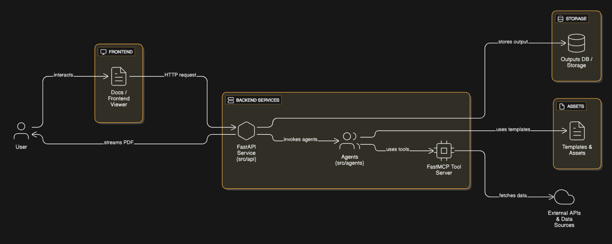
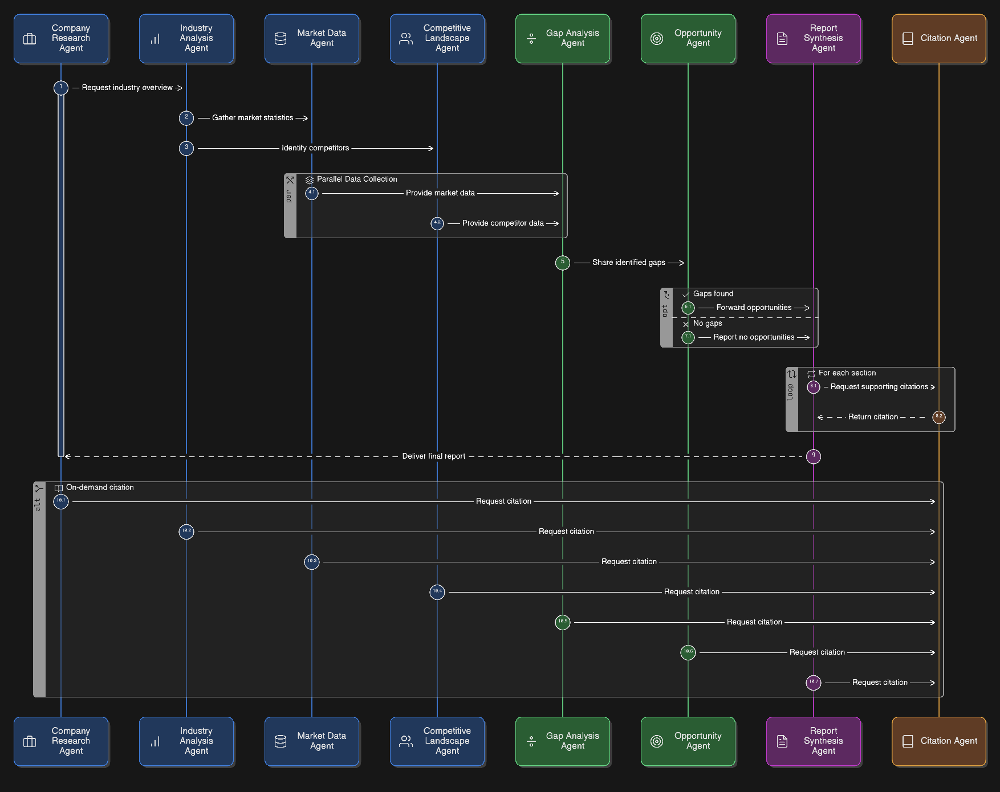
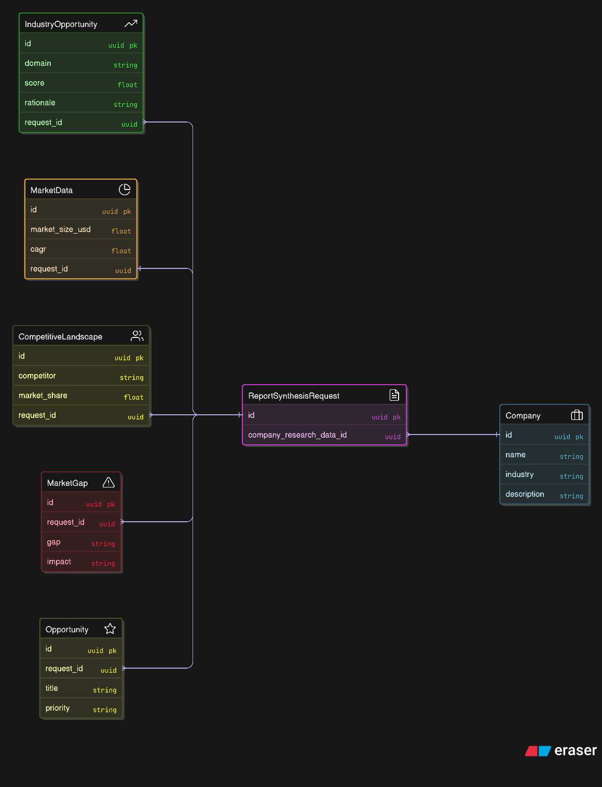
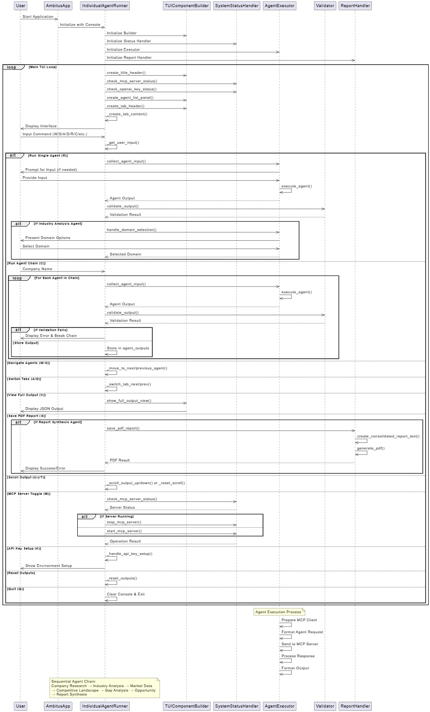
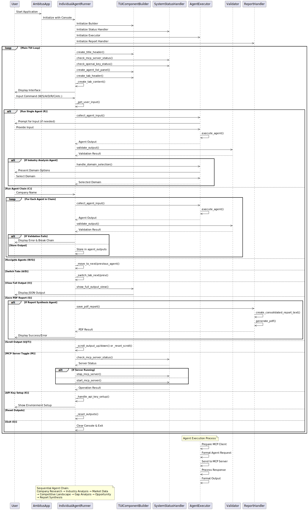

# Flowcharts

This folder contains project diagrams used across the docs and README.

## Diagrams

- 🛠️ Deploy Runtime Architecture
  
  
  - Shows runtime components: FastAPI API layer, Agents (src/agents), FastMCP tool server, external data sources/APIs, and storage.
  - Highlights request routing, agent invocation, MCP tool calls, and the path to PDF generation.
  - Useful for ops: where to scale, where to cache, and boundaries between internal services vs. external APIs.

- 📄 End‑to‑End Report Synthesis
  
  
  - Sequence from client request → input validation → report_synthesis_agent → Jinja template → WeasyPrint → PDF/JSON response.
  - Captures error/validation branches and headers used for file download.
  - Helps debug schema mismatches and output validation steps.

- 🏗️ High‑Level System Architecture
  
  
  - Big‑picture view of users (TUI/CLI/API), orchestration layer, agents, MCP tools, and data persistence.
  - Clarifies responsibilities and integration points between subsystems.
  - Good starting point for newcomers to understand the platform topology.

- 🤖 Multi‑Agent Orchestrator Workflow
  
  
  - Linear flow: CompanyResearch → IndustryAnalysis → MarketData/CompetitiveLandscape → GapAnalysis → Opportunity → Report Synthesis.
  - Shows optional domain selection and on‑demand CitationAgent/tool usage.
  - Useful to trace inputs/outputs passed between agents.

- 🧬 Report Synthesis Data Models
  
  
  - Pydantic models involved in report synthesis (Company, IndustryOpportunity, CompetitiveLandscape, MarketData, MarketGap, Opportunity).
  - Request/response contracts for ReportSynthesisRequest/ReportSynthesisResponse and expected list shapes.
  - Aids API contract reviews and validator/schema alignment.

- 🖥️ TUI Interaction UML
  
  
  - UML depiction of the terminal UI modules, command handlers, and navigation flow.
  - Shows how user actions map to CLI/TUI commands and invoke API routes/agents.
  - Useful for onboarding contributors working on the TUI/CLI experience.

- 📘 Ambitus UML Overview
  
  
  - High‑level UML of components: API routes, validators, agents, models, and their relationships.
  - Clarifies dependencies between layers and where cross‑cutting concerns (logging/validation) live.
  - Handy reference when refactoring module boundaries or adding new agents.
