# System Overview

This document describes the end‑to‑end architecture of **Ambitus Intelligence**, including how AI agents are orchestrated, how data flows, and how external tools are exposed via an MCP server.

---

## High‑Level Architecture
A sequential network of AI AGENTS operates as MCP Clients, interfacing with our central FastMCP server. This server hosts an extensive collection of tools and data sources, providing a robust infrastructure for agent operations.

The following diagram illustrates the high‑level architecture of the system:
> NOTE: Actual count of agents is not represented in the diagram.

---
## Agent Responsibilities
Each agent in the system is responsible for a specific set of tasks, which are outlined in detail in the **agent_specs.md** document. This includes their input/output schemas, dependencies, and any other relevant information.

The agents communicate with the FastMCP server to access tools and data sources, enabling them to perform their designated functions efficiently.

### Data Flow

The arrangement of agent is sequential, meaning that the output of one agent can serve as the input for the next. This sequential output will also be served to our **web application**, which will be responsible for displaying the results to the user.

#### Agent (mcp-server) Level

```mermaid
flowchart TD
  U[User]:::user --> CRA[Company Research Agent]:::step1
  CRA --> IDA[Industry/Domain Analysis Agent]:::step2
  IDA --> DS{Domain Selection}:::decision
  DS --> MDA[Market Data Agent]:::step3
  DS --> CLA[Competitive Landscape Agent]:::step4
  MDA --> GA[Gap Analysis Agent]:::step5
  CLA --> GA
  GA --> OA[Opportunity Agent]:::step6
  OA --> RSA[Report Synthesis Agent]:::step7

  subgraph "Citation/Data Collector Agent"
    CIT[Citation Agent]:::tool
  end

  CRA -->|on‑demand| CIT
  IDA -->|on‑demand| CIT
  MDA -->|on‑demand| CIT
  CLA -->|on‑demand| CIT
  GA -->|on‑demand| CIT
  OA -->|on‑demand| CIT

  classDef user       fill:#a0d8ef,stroke:#333,stroke-width:1px;
  classDef step1      fill:#b3cde0,stroke:#333,stroke-width:1px;
  classDef step2      fill:#ccebc5,stroke:#333,stroke-width:1px;
  classDef step3      fill:#ffffcc,stroke:#333,stroke-width:1px;
  classDef step4      fill:#fbb4ae,stroke:#333,stroke-width:1px;
  classDef step5      fill:#e5f5e0,stroke:#333,stroke-width:1px;
  classDef step6      fill:#fdd0a2,stroke:#333,stroke-width:1px;
  classDef step7      fill:#d9d9d9,stroke:#333,stroke-width:1px;
  classDef decision   fill:#fed976,stroke:#333,stroke-width:2px,stroke-dasharray:5 5;
  classDef tool       fill:#decbe4,stroke:#333,stroke-width:1px,stroke-dasharray:2 2;
```

#### Web Application Level

```mermaid
flowchart LR
  subgraph Frontend
    NEXT[Next.js App]:::frontend
  end

  subgraph Backend
    API[ambitus‑ai‑backend <br/> MCP Client & Server]:::backend
  end

  DB[(Outputs Database)]:::database

  NEXT --> |"GET /api/agents/output"| API
  NEXT --> |"read/write"| DB
  DB --> |"data"| NEXT
  API --> |"JSON"| NEXT

  classDef frontend fill:#a0d8ef,stroke:#333,stroke-width:2px,rx:5,ry:5;
  classDef backend  fill:#c9ffff,stroke:#333,stroke-width:2px,rx:5,ry:5;
  classDef database fill:#fdd0a2,stroke:#333,stroke-width:2px,rx:5,ry:5;

```

## MCP Server [Tools & Data Sources]
The FastMCP server is the core of our system, providing a centralized location for all tools and data sources. Each agent can access these resources as needed, allowing for efficient data processing and analysis.

> ⚠️🚧: Exact choice of tools and data sources is still under discussion and continuously changing. This part of documentation will be updated once it gets consolidated.
>
> **NOTE:** Upon completion, the tools and data sources will be listed in the **mcp_server.md** document along with their respective configurations and usage instructions. 

## References
- [MCP Tool Documentation](https://docs.haystack.deepset.ai/docs/mcptool)
- [MCP Integrations Reference](https://docs.haystack.deepset.ai/v2.4/reference/integrations-mcp)
- [Agent Definition Example](https://github.com/TheMimikyu/spring-into-haystack/blob/main/src/github-agent.py)